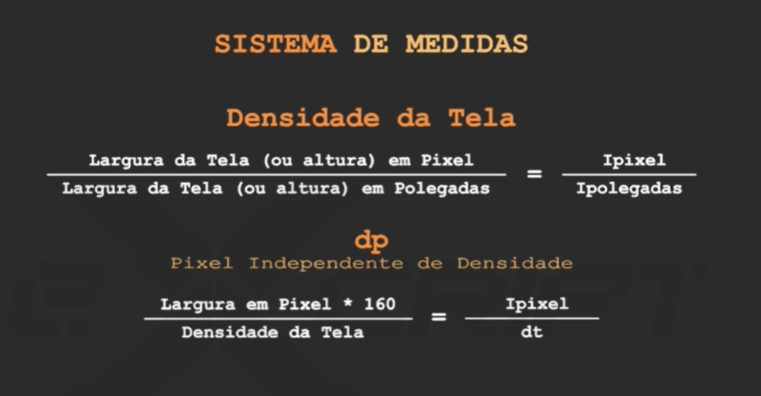
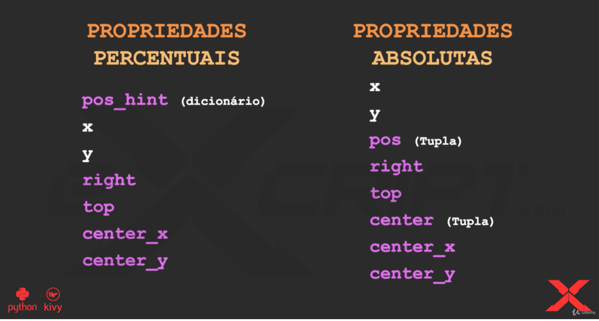
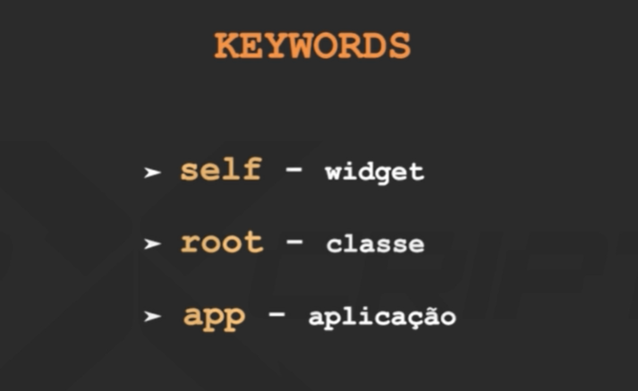

# applications-with-kivy-in-python
- Repositório para o curso da framework kivy do python
- Desenvolvimento de Apps Comerciais com Python e Kivy para Android, iOS,

## para uso
* intale as dependências dos requerimentos
```shell
pip install -r requirement.txt
```
- [x] [Manual em português do kivy](kivy-pt_br-excript.pdf)

### Recursos interessante (Regras)
#### ```property```
- Nunca se acessa diretamente as variáveis.
- uso do ```property(fget= , fset= )``` </br>
- - ```var = property(fget=_get_var, fset=_set_var)```
- - o uso do __ ante da variável, indica as compilador que ela não pode ser acessada diretamente. </br>
Exemplo:
```python
class Retangulo:

    def __init__(self, largura, altura):
        self._largura = 0 #Não pode acessar diretamente, utilizar os metodos acessores
        self._altura = 0 #Não pode acessar diretamente, utilizar os metodos acessores
        self._set_altura(altura) #metodo acessor
        self._set_largura(largura) #metodo acessor

    def _set_altura(self, num):
        if(not(isinstance(num, int) and (num > 0))):
            raise ValueError("Altura é inválida: {}".format(num))
        self._altura = num
        self.__var = 456

    def _set_largura(self, num):
        if(not(isinstance(num, int) and (num > 0))):
            raise ValueError("Largura é inválida: {}".format(num))
        self._largura = num
    def _get_area(self): #metodo de solicitação
        return self._largura * self._altura
    def _get_altura(self): #metodo de solicitação
        return self._altura
    def _get_largura(self): #metodo de solicitação
        return self._largura


    altura = property(fget=_get_altura,  fset=_set_altura)
    largura = property(fget=_get_largura, fset=_set_largura)
    area = property(fget=_get_area)

r = Retangulo(altura=10, largura=5)
r.largura = 50
r.altura = 10
print(r.altura)
print(r.largura)
print('valor de area')
print(r.area)
```


#### ```@property com @metodo.setter```
Exemplo
```Python
class Retangulo:

    def __init__(self, largura, altura):
        self._largura = 0 #Não pode acessar diretamente, utilizar os metodos acessores
        self._altura = 0 #Não pode acessar diretamente, utilizar os metodos acessores
        self.altura = altura #metodo acessor
        self.largura = largura #metodo acessor

    @property
    def altura(self): #metodo de solicitação
        return self._altura
    @altura.setter
    def altura(self, num):
        if(not(isinstance(num, int) and (num > 0))):
            raise ValueError("Altura é inválida: {}".format(num))
        self._altura = num


    @property
    def largura(self): #metodo de solicitação
        return self._largura
    @largura.setter
    def largura(self, num):
        if(not(isinstance(num, int) and (num > 0))):
            raise ValueError("Largura é inválida: {}".format(num))
        self._largura = num
    @property
    def area(self): #metodo de solicitação
        return self._largura * self._altura

r = Retangulo(altura=5, largura=5)
r.largura = 5
r.altura = 10
#r.area = 100 #Levanta um erro, pois é apenas captura de valor em vez de setar valor.
print("valor da altura: ", r.altura)
print('valor da largura: ', r.largura)
print('valor de area: ', r.area)
```
## Classe em Python
- As classe são utilizadas para criar objetos e em __Python__ as mesmas também são objetos.
- Cuidado com as nomenclatura:
- [x] MEMBROS DE CLASSE
- [x] MEMBROS DE INSTÂNCIAS
- Aprenderemos a operar um membro de classe.

* Ao operar as classes, altera-se todos os membros juntos, se alterar apenas o membro será alterado apenas no referido.
* Na busca por atributos o __Python__, irá busca primeiro na membro atributo, caso não encontre ele busca na classe.


- Exemplo de Método de classe:
```python
class A:
  #Todas as instancias possuem acesso
  @classmethod
  def fun(cls, arg1, arg2, ...):
    pass #Informa que não irei implementar por enquanto

```
## Método Estáticos
- Não possui relação direta com a classe, porém são membro de classe. sem a declaração de parâmetros "cls" ou "self"
## Posicionamento
- A biblioteca __Kivy__ opera no primeiro plano cartesiano.
- o Posicionamento se baseia-se no ângulo inferior esquerdo, para início do posicionamento.
- É de responsabilidade do programador posicionar as janelas, caso contrario, não será exibido na tela
- Sistemas de medidas responsivo.
- Definir de forma automática com consequência a resolução das telas(pixel).
- dp, independa do tamanho da tela é proporcional a largura de pixel pela densidade da tela.


## Tela com algumas funcionalidades da biblioteca __kivy__
- A aplicação permite apenas um widget's principal, porém, cria-se leiautes para várias janelas.
```python
from kivy.app import App
from kivy.uix.label import Label          #Escrita de texto
from kivy.uix.button import Button        #Botão
from kivy.uix.textinput import TextInput  #Entrada de texto

```


# Linguagem __Kivy__

```python
<ClassName>: #É o top da janela, (Haverá uma única janela, pois os dispositivos moveis usam apenas uma janela)
  LayoutType: #Gerenciador de Layout
    WidgetType: # Widget (Terá vários)
      pos: 10, 10
      size: .5, .5

  LayoutType2: #Gerenciador de Layout generico
      font_size: 70
      center_x: root.width / 4
      top: root.top - 5
      text: "0"

```
## Propriedades Percentuais




## Para testes de tela em diversas telas de aparelhos movéis :D

```sheel
activate k35 #Ativa o ambiente virtual do python 3.5

#Vá no diretório da aplicação
dir "caminho_path_app"

python nome_app.py -m screen #Lista os dispositivos suportados

pyhton nome_app.py -m screen:nome_dispositivo
```

### ipython
- Roda em linha de comando e interage em diversas outros scripty

```shell
cd dir_app

jupyter notebook #Abre o jupyter no navegador padrão

```
## kivy


- MinhaApp - minha.kv
- ProgramaApp - programa.kv
- Prog - prog.kv


## Palavras reservadas em Kivy




```kivy
<Class>:
    Label:
        text: str(self.opacity) # Aponta para 


<Classe>:
    Label:
      #root = <Classe> Aponta para a classe implementada pelo pyhton
      text:root.orientation


###############################
<Class>:
    Label:
        app.name


```
